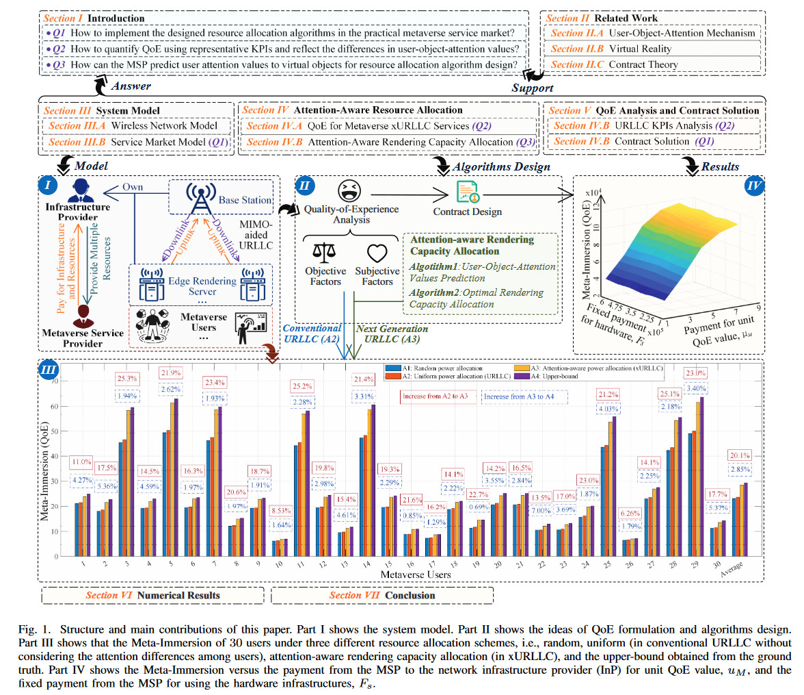

# Attention-aware Resource Allocation and QoE Analysis for Metaverse xURLLC Services

This repository contains the code accompanying the paper:

> **"Attention-aware Resource Allocation and QoE Analysis for Metaverse xURLLC Services"**

Authored by Hongyang Du, Jiazhen Liu, Dusit Niyato, Jiawen Kang, Zehui Xiong, Junshan Zhang, and Dong In Kim, accepted by IEEE JSAC.

The paper can be found at [ArXiv](https://arxiv.org/abs/2208.05438).



---
## 🔧 Environment Setup

To create a new conda environment, execute the following command:

```bash
conda create --name aqoe python==3.10
```
## ⚡Activate Environment

Activate the created environment with:

```bash
conda activate aqoe
```
## 📦 Install Required Packages

The following package can be installed using pip:

```bash
pip install eals
```

## 🏃‍♀️ Run the Program

Run `main.py` in the file `Main` to start the program.

## 🔍 Check the results

Please refer to [here](https://github.com/HongyangDu/User-Object-Attention-Level) to check the details abouth the User-Object-Attention Level (UOAL) dataset.

After generating randomly the sparse user-object-attention matrix, please put the 'my_rating.csv' under 'Seg2Rating' file.

Run `main.py` in the file `Main`. Then the predicted user-object attention values can be obtained and saved as 'pred.txt'


The compare between the predicted values and the ground truth values is shown as 


## 📚 Acknowledgement

As we claimed in our paper, this repository used the codes in the following paper:

```bash
eALS: A Python implementation of the element-wise alternating least squares (eALS) for fast online matrix factorization
GitHub: https://github.com/newspicks/eals
```

Please consider to cite eALS if their codes are used in your research.


---

## Citation

```bibtex
@article{du2023attention,
  title={Attention-aware resource allocation and QoE analysis for metaverse xURLLC services},
  author={Du, Hongyang and Liu, Jiazhen and Niyato, Dusit and Kang, Jiawen and Xiong, Zehui and Zhang, Junshan and Kim, Dong In},
  journal={IEEE Journal on Selected Areas in Communications},
  year={2023},
  publisher={IEEE}
}
```
